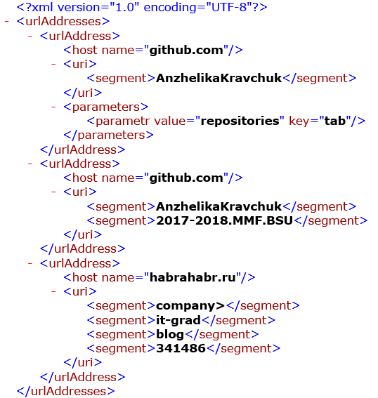

The text file contains information about URLs represented as **&lt;scheme&gt;://&lt;host&gt;/&lt;URL‐path&gt;?&lt;parameters&gt;**, where parameters part is a set of key=value pairs (*URL‐path* segment or *parameters* segment can be omitted). Develop a type system (use SOLID principles) for exporting data obtained by parsing file into an XML document according to the following rule, for example, for a text file with URLs
```
https://github.com/AnzhelikaKravchuk?tab=repositories 
https://github.com/AnzhelikaKravchuk/2017-2018.MMF.BSU
https://habrahabr.ru/company/it-grad/blog/341486/ 
```
the resulting XML file (use any XML framework):



If URL doesn't match the pattern, "log" information about it (mark lines as unprocessed). Develop console application.
- [Class library project](UrlsToXml.Library)
- [Console UI project](UrlsToXml.ConsoleUI)
